# Ankunft+ 🇩🇪

## Integration Guidance Platform for Migrants in Germany

Ankunft+ is a full-stack web application that helps newcomers understand and navigate essential integration steps in Germany through guided onboarding and localized insights.

The platform converts user responses into personalized guidance and regional statistics, improving clarity and decision-making during the integration process.

## Key Highlights

- Full-stack architecture (FastAPI + React)
- REST API with structured data modeling
- Dynamic statistics based on user input
- Location-aware insights (region & city level)
- Secure JWT authentication
- UX focused on clarity and positive guidance

## Architecture Overview

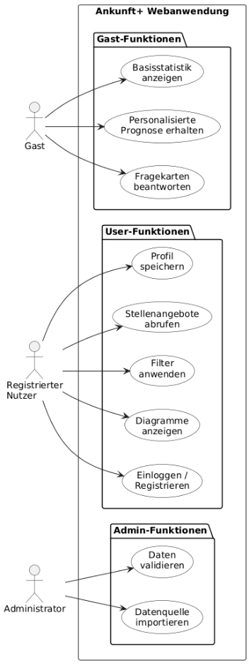
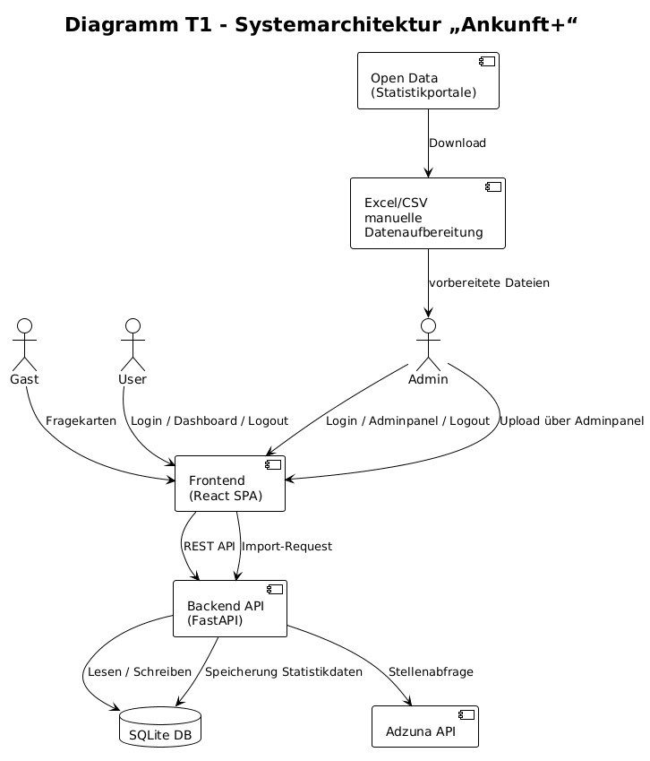
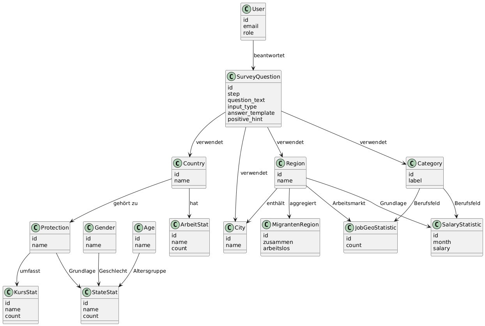
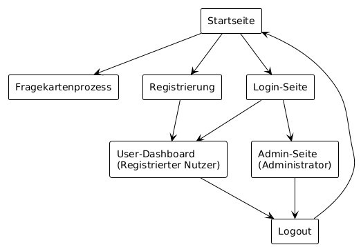
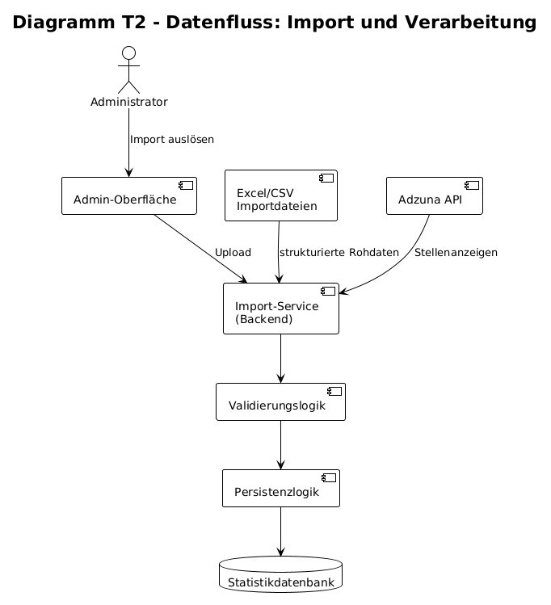
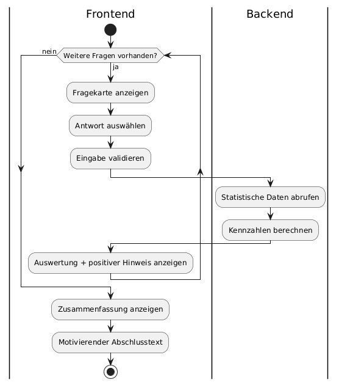

### Backend

- FastAPI REST API
- SQLAlchemy ORM
- PostgreSQL database
- Data aggregation & statistics engine

### Frontend

- React + TypeScript
- Component-based architecture
- Responsive & accessible UI

## Core Features

- Guided step-by-step onboarding survey
- Real-time statistics generated from answers
- Regional and city-based insights
- Clear progress flow for users
- Clean, intuitive user experience

## Data & Insights

The system aggregates user responses to generate:

- integration progress indicators
- regional trends & statistics
- localized insights for better planning

## UI Preview

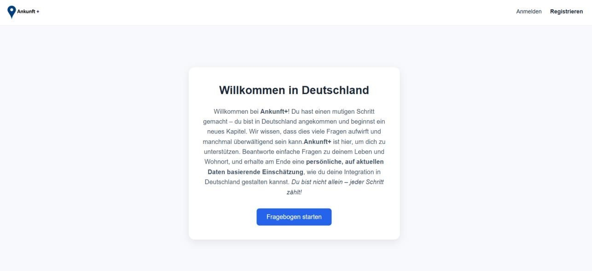
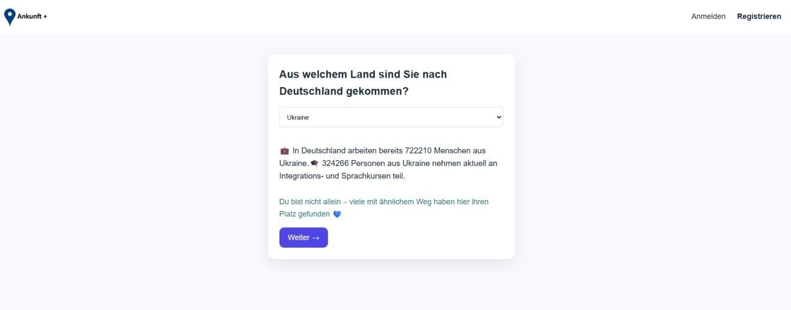
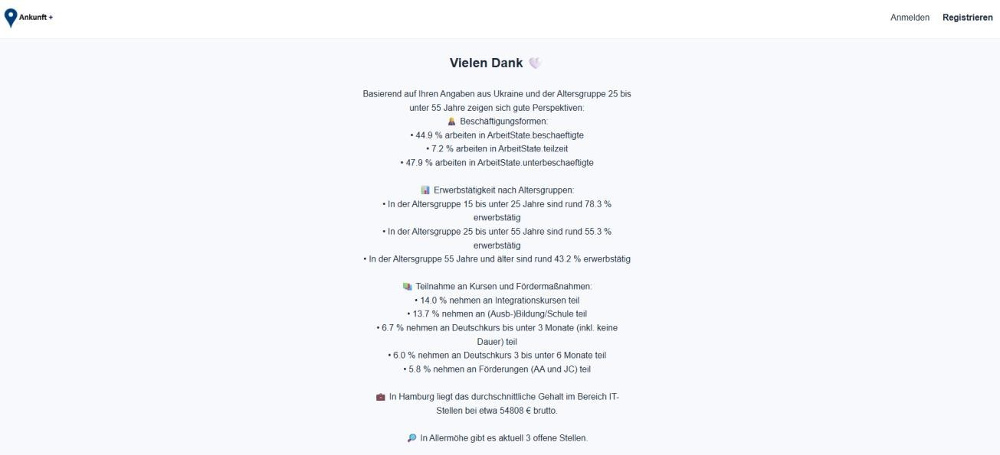
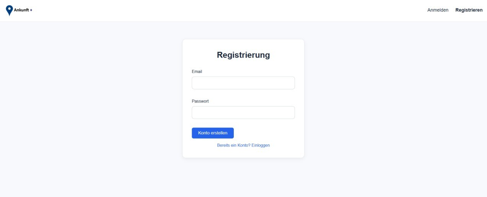
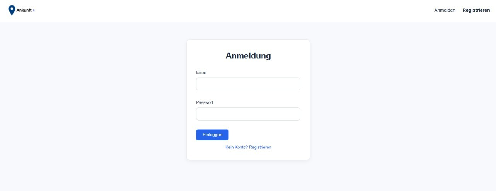
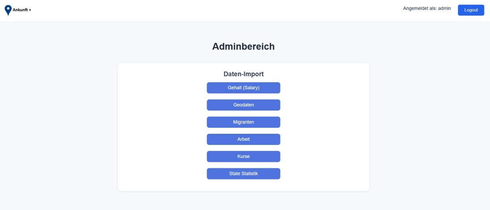
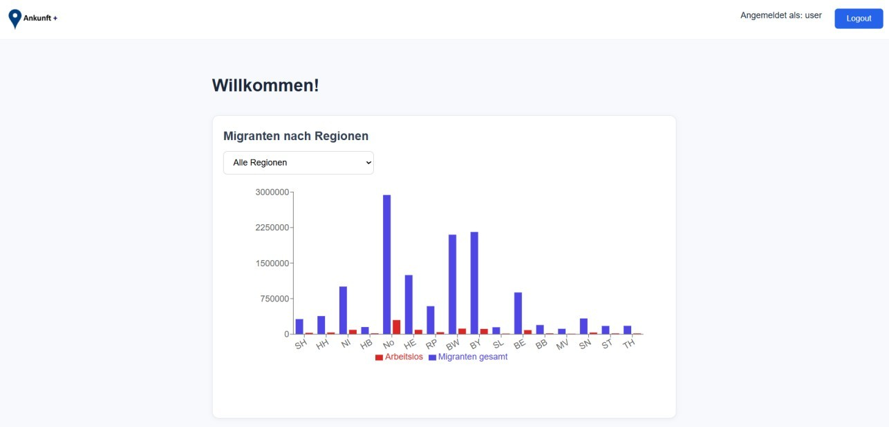
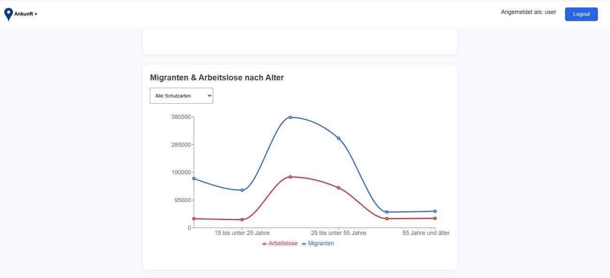
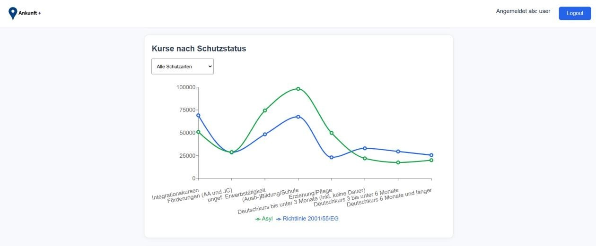
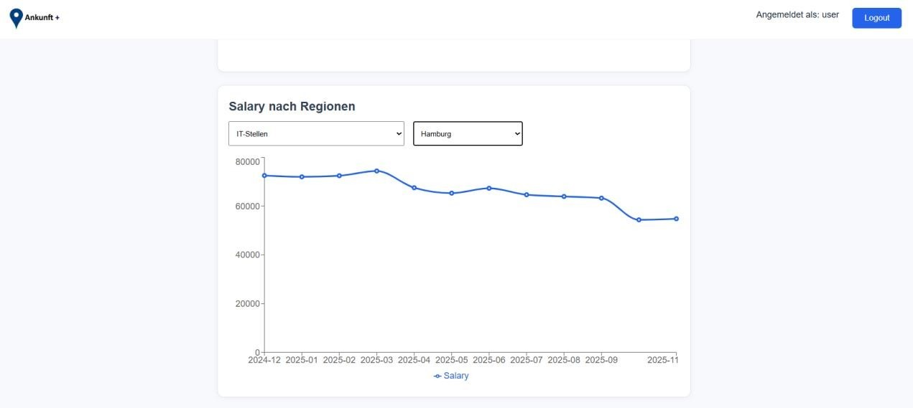
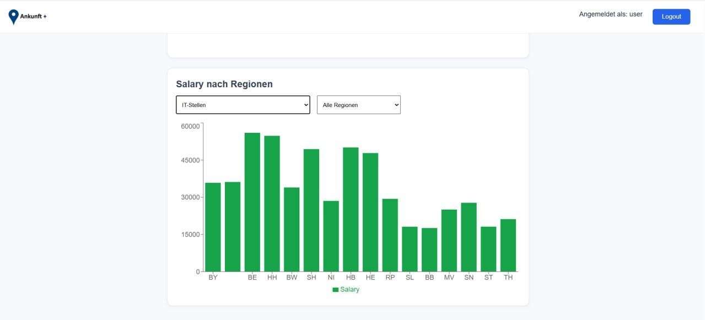

Suggested screenshots:

- onboarding survey flow
- results & statistics view
- regional insights dashboard

## Authentication

JWT-based authentication ensures secure session handling and protected API access.

## Run Locally

### Backend
uvicorn app.main:app --reload
### Frontend
cd frontend
npm install
npm run dev

## Why This Project Matters

This project demonstrates the ability to design and implement a real-world full-stack system with secure authentication, structured data handling, and user-focused UX.
